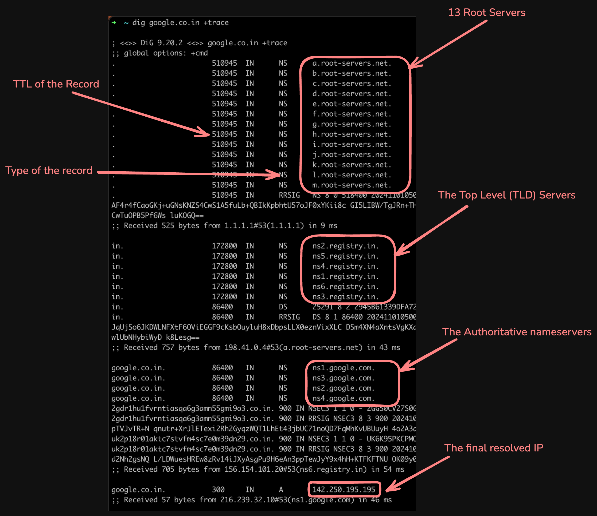

I recently moved this blog from GitHub to its own domain, and I was surprised to see how streamlined and fast the whole
process was. It barely took me 30 minutes to set up everything, with Cloudflare doing most of the heavy lifting. Since
then, I've been tinkering with the Cloudflare dashboard, its online glossary, and other resources to understand how it
all works. Unsurprisingly, a lot is going on under the hood. I am writing to summarize what I've learned
so far. Most of this will be rehashing what's already out there with some hands-on examples.

## Who am I getting the domain from?

I go to a domain registrar, click a few buttons, and voila! I have got my own domain. But what happens under the hood?

Let's talk about ICANN; ICANN is a global non-profit organization that has authority over all the top-level
domains (called TLDs). It delegates this responsibility to registry operators (Verisign for .com, .net, etc.).
These registries, in turn, delegate the sales to domain registrars (like Cloudflare, GoDaddy, Namecheap, etc.). These
registrars use a protocol called [EPP](https://en.wikipedia.org/wiki/Extensible_Provisioning_Protocol) to communicate
with the registry and perform operations like registering a domain, renewals, etc.

Note that there are two types of TLDs:
gTLDs (generic TLDs like .com, .net) and ccTLDs (country code TLDs like .in, .uk). The latter is managed by the
respective country. So, the ccTLDs have their own country-specific set of regulations.

The hierarchy looks like this:
<figure>

<figcaption>Source: <a href="https://www.cloudflare.com/en-gb/learning/dns/glossary/what-is-a-domain-name-registrar/">Cloudflare: What is a domain name registrar?
</a> </figcaption>
</figure>


**Fun fact:** All two-letter top-level domains (like .in, .ai, .io) are ccTLDs. They are the two-letter ISO
country codes for the respective countries. And
the [.io domain might disappear soon](https://every.to/p/the-disappearance-of-an-internet-domain)

## How does the domain point to my server?

I have a domain of my own now, but how do I get it to point to my server? This is where the Domain Name System (DNS)
comes in. We all know about DNS, it's a phonebook of sorts for the internet. It maps domain names to IP addresses. I
always thought that the DNS was a single monolithic system that stored all the domain records. But it's actually not the
case.

<figure>

<figcaption>Source: <a href="https://www.cloudflare.com/en-gb/learning/dns/what-is-dns/">Cloudflare: What is DNS?</a>
</figcaption>
</figure>

The DNS servers we are familiar with (1.1.1.1, 8.8.8.8/8.8.4.4) are called recursive resolvers. There are three
other kinds of DNS servers in the whole DNS hierarchy:

* The root servers
* The TLD servers
* The authoritative servers

Let's see how they all fit together with an example below.

### DNS resolution in action

I am going to use the `dig` command. You can install it using `brew install bind` on macOS and
`sudo apt install dnsutils` on Linux. Now let's run a trace for "google.co.in":

```bash
dig google.co.in +trace
```

The output will look something like this:


Let's break down what's happening here:

1. You enter "google.co.in" in your browser.
2. The browser sends a query to the recursive resolver (1.1.1.1, in this case), which in turn asks the root servers
3. The root server (`a.root-servers.net`) responds with the TLD servers for `.in` (ccTLD for India, the registry is
   `registry.in`).
4. The recursive resolver then asks the TLD server for the authoritative server for "google.co.in".
5. The TLD server (`ns6.registry.in`) responds with the authoritative servers for "google.co.in".
6. The recursive resolver then asks the authoritative server for the IP address of "google.co.in".
7. The authoritative server (`ns1.google.com`) is the final stop in the DNS hierarchy. It holds actual DNS records for
   the domain. It responds
   with the IP address of "google.co.in", `142.250.195.195` in this case.

There are some other details in the output, like the type of the record (`NS`, `DS`, `RRSIG`), `TTL` (Time To Live)
for the records, query time, etc.

### Some fun facts about DNS

* Not all the queries go through this whole process. It will often be cached at several levels. For example, your
  browser, the operating system, some routers and at the recursive resolver, etc.
* There are [13 root servers worldwide](https://www.iana.org/domains/root/servers) (Same ones we saw above), well sort
  of. These are replicated across the globe, so there are actually thousands of root servers. but they all share the
  same IP address! This is possible because
  of [Anycast routing](https://www.cloudflare.com/en-gb/learning/dns/what-is-anycast-dns/). Every resolver has the IP of
  these 13 root servers built-in.
* You can change the authoritative server for your domain via your registrar. In fact, I can go to my cloudflare
  dashboard and create DNS records for "example.com", but it won't work because the domain's registry is pointing to a
  different nameserver.

### The DNS records

The authoritative server holds the domain's actual DNS records. There are tens of different types of DNS records,
but the ones you will most commonly use and encounter are given below:

* `A`: Maps a domain/subdomain to an IPv4 address. This is what you need to get a website working. For example,
  `dig anjaygoel.com A` will return the IPv4 address of my server: `anjaygoel.com.		115	IN	A	172.67.168.31`
* `AAAA` : Maps a domain/subdomain to an IPv6 address.
* `CNAME`: Forwards to another domain/subdomain. It's like a reference to another domain.
* `NS`: Specifies the authoritative server for the domain. Like in the output above.
* `MX`: Redirects email traffic to a mail server.
* `TXT`: Holds text data. Often used for verification purposes. For example, Google uses it for domain verification in
  Google Search Console. `dig anjaygoel.com TXT` will the following output:
  ```
  anjaygoel.com.		300	IN	TXT	"v=spf1 -all"
  anjaygoel.com.		300	IN	TXT	"google-site-verification=aTRw2UBBr_jg-Z_WM0kMf6mgXnzrCIgd54xcZtXohIk"
  ```
* `PTR`: Maps an IP address to a domain/subdomain. This is useful for reverse DNS lookups. They are stored as
  `<reverse-ip>.in-addr.arpa` under the `.arpa` TLD. You can use `dig -x <ip>` for a reverse lookup.

### DNS as a load balancer!

Going a little off-topic, But I found this super cool. You can actually use DNS to load balance traffic across multiple
servers! Based on the load balancing algorithm, the DNS server will return different A/AAAA records for the same domain.
Let's see this in action:

`dig facebook.com` gives me `57.144.124.1` on my PC. If I do a reverse lookup using `dig -x 57.144.124.1`, I get the
pointer record as `edge-star-mini-shv-03-bom2.facebook.com.` (Bom as in Bombay or Mumbai). But if I do the same on a
colab notebook, I get a different IP address, `31.13.67.35` and the reverse lookup gives me
`edge-star-mini-shv-01-mia3.facebook.com`. (mia as in Miami) which is closer to where my colab notebook is running (
South Carolina).

## The other stuff

A few other things are going on behind the scenes needed to get a website working. Such as SSL/TLS certificates to
enable HTTPS, CDN networks, and Cloudflare's DDOS protection.
Perhaps, I'll cover them in a future post.

## References

* [What is a domain name registrar?](https://www.cloudflare.com/en-gb/learning/dns/glossary/what-is-a-domain-name-registrar/)
* [What is DNS](https://www.cloudflare.com/en-gb/learning/dns/what-is-dns/)
* [DNS for Rocket Scientists](https://www.zytrax.com/books/dns/)
* [DNS root server](https://www.cloudflare.com/en-gb/learning/dns/glossary/dns-root-server/)
* [DNS records](https://www.cloudflare.com/en-gb/learning/dns/dns-records/)
* [What is DNS load balancing](https://www.cloudflare.com/en-gb/learning/performance/what-is-dns-load-balancing/)
